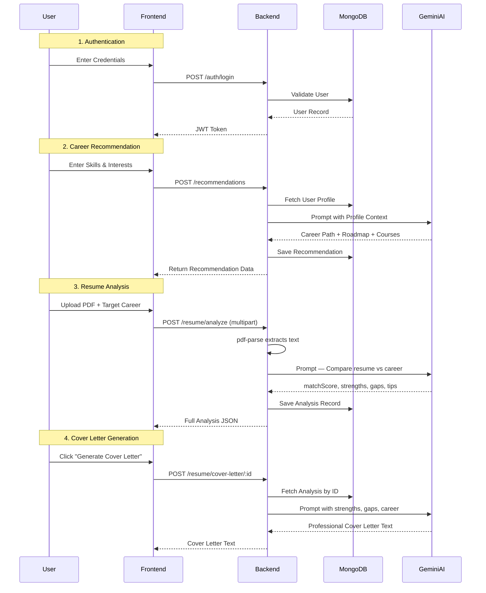
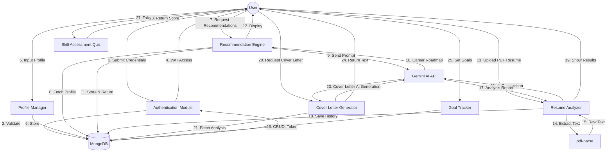

# [College / University Name]

### Department of [Department Name]

 
 

**Course:** [Course Name] & [Semester]

 
 

## PROJECT REPORT
**ON**

# PathFinder AI

*(Software Requirement Specification & Project Report)*

 
 

**Submitted To:**

**[Guide / Faculty Name]**  
*[Designation]*  

 

**Submitted By:**

**Name:** [Student Name]  
**Roll No:** [Roll Number]  
**Reg No:** [Registration Number]  

 
 

  
*(Optional: Insert College Logo)*

 
 

**[Place]**  
**March 2026**  

---

# Table of Contents
*   **Revision History** ................................................................. ii
*   **Chapter 1: Introduction**
    *   1.1 Purpose
    *   1.2 Aim
    *   1.3 Objectives
    *   1.4 Product Scope
    *   1.5 User Classes and Characteristics
    *   1.6 Operating Environment
    *   1.7 Assumptions and Dependencies
*   **Chapter 2: Literature Survey**
    *   2.1 Survey of Existing Systems
    *   2.2 Findings and Research Gap
*   **Chapter 3: System Architecture**
    *   3.1 User Interfaces
    *   3.2 Hardware Interfaces
    *   3.3 Software Interfaces
    *   3.4 Communications Interfaces
    *   3.5 System Features
*   **Chapter 4: System Flow / Architecture**
    *   4.1 System Flow (Architecture)
    *   4.2 Data Flow Diagram (DFD)
    *   4.3 API Data Flow Verification
*   **Chapter 5: Model Design**
    *   5.1 Phase I: Requirement Analysis
    *   5.2 Phase II: Backend & Core Features (Completed)
    *   5.3 Phase III: Advanced Features (Completed)
*   **Chapter 6: Conclusion**
*   **Chapter 7: Future Scope**
*   **Appendix A: List of Figures**
*   **Appendix B: List of Tables**
*   **Appendix C: List of Acronyms**

---

# Revision History

| Version | Date       | Description                                          | Author         |
| :------ | :--------- | :--------------------------------------------------- | :------------- |
| 1.0     | 2024-12-19 | Initial Draft of SRS and Project Report              | [Student Name] |
| 1.1     | 2024-12-19 | Updated with Core Recommendation Flow Logic          | [Student Name] |
| 1.2     | 2025-12-20 | Added Goal Tracker and Skill Quiz modules to scope   | [Student Name] |
| 1.3     | 2026-03-08 | Full platform implementation — all modules completed | [Student Name] |

---

# Chapter 1: Introduction

### 1.1 Purpose
PathFinder AI is a comprehensive, AI-driven career guidance platform. Its purpose is to help students and job seekers identify optimal career paths by analyzing their skills, interests, and qualifications — and then providing a full ecosystem of tools to bridge the gap between their current state and their career goal. The platform leverages Google's Gemini large language model (LLM) for all AI-generated content, from career suggestions to personalized learning roadmaps, resume feedback, and professional cover letters.

### 1.2 Aim
The aim of the project is to build a fully functional, production-ready web application that acts as a personal career coach. The system provides a streamlined "Input-to-Insight-to-Action" journey: users enter their profile, receive AI-generated career recommendations, can check their resume against their target role, track their learning goals, assess their skills, and generate application documents — all within a single platform.

### 1.3 Objectives
-   **Core Recommendation Engine:** Develop backend logic that accepts user skills, interests, and qualifications and returns tailored career recommendations with confidence scores, learning roadmaps, and verified course links.
-   **Resume Analysis:** Implement an AI-powered resume checker that compares a user's uploaded PDF resume against a target career, returning a percentage match score, identified strengths, missing skills, and improvement steps.
-   **Cover Letter Generation:** Automatically generate a tailored cover letter by combining resume analysis data with the target career context.
-   **Skill Visualization:** Represent the gap between a user's current skills and the ideal career profile using an interactive radar chart.
-   **Goal Tracking:** Allow users to set and manage career-related goals with deadlines and priority levels.
-   **Skill Assessment:** Provide a categorized multiple-choice quiz system for users to verify their self-assessed skill levels.
-   **Market Insights:** Surface live job market data and trends relevant to the user's target career.
-   **Security:** Ensure safe, authenticated user access using JWT-based session management.
-   **Responsive UI:** Deliver a premium, professional interface with dark/light mode support across all devices.

### 1.4 Product Scope
The platform is fully implemented and operational. The complete feature set includes:
-   **Completed:** User Authentication (Login/Register), Profile Management, AI Career Recommendation Engine, Learning Roadmap Generator, AI Resume Analyzer (PDF Upload), Resume History, AI Cover Letter Generator, Skill Matrix Visualization (Radar Chart), Goal Tracker, Skill Assessment Quiz, Market Insights page, Interactive Home Page with Hero carousel.
-   **Future Enhancements:** Interview Prep Coach, Job Description Matcher, and Portfolio Project Generator (planned for the next development phase).

### 1.5 User Classes and Characteristics
-   **Students:** Users seeking clarity on which career path aligns with their skill set and interests.
-   **Job Seekers:** Professionals looking to pivot careers or improve their application materials (resume, cover letter).
-   **Admin:** System maintenance and user database management.

### 1.6 Operating Environment
-   **Frontend:** Web Browser (Chrome/Edge/Firefox) running a React.js (Vite) application served on Port 5000.
-   **Backend:** Node.js + Express.js server running on Port 3000.
-   **Database:** MongoDB (Atlas Cloud) for persistent data storage.
-   **AI Service:** Google Gemini API (gemini-flash-latest model).

### 1.7 Assumptions and Dependencies
-   **Assumption:** Users provide reasonably accurate profile data. The AI quality improves with richer input.
-   **Dependency:** An active internet connection is required for Google Gemini API calls.
-   **Dependency:** Resume files must be text-readable PDFs for accurate AI extraction.

---

# Chapter 2: Literature Survey

### 2.1 Survey of Existing Systems
Existing platforms typically fall into one of three categories:
1.  **Manual career counseling** (e.g., Mindler): High cost, slow process (psychometric tests take 1.5+ hours), and not available 24/7.
2.  **Resume-focused tools** (e.g., Kickresume, Zety): Focus on formatting and aesthetics, not on helping users understand which career they should target.
3.  **Static roadmap resources** (e.g., Roadmap.sh): Provide community-curated tech roadmaps, but they are generalized and not personalized to the individual user's existing skills.

None of these platforms offer an end-to-end journey: from career discovery → resume gap analysis → goal setting → skill assessment → application document generation, all within a single AI-powered system.

### 2.2 Findings and Research Gap
The primary research gap is the absence of a holistic, AI-driven platform that treats career development as a continuous journey rather than a one-time event. PathFinder AI fills this gap by:
-   Weighing the user's **interests and self-assessed skills** alongside their qualifications.
-   Closing the loop between "knowing what to learn" (Roadmap) and "proving you've learned it" (Skill Quiz + Goal Tracker).
-   Providing **job application tools** (Resume Analysis, Cover Letter) within the same authenticated session.

---

# Chapter 3: System Architecture

### 3.1 User Interfaces
All user interfaces are fully implemented with a professional dark/light mode design system.

-   **Home Page:** A dynamic marketing page with an animated hero section featuring a rotating "Career Intelligence Module" carousel, auto-scrolling "Intelligence Inventory" (partner tech stack), detailed feature showcases, and a career quiz section.
-   **Login/Signup:** Secure forms with password visibility toggle and input validation.
-   **Dashboard:** A compact, data-rich overview showing the user's top career recommendation, skill summary, recent goal progress, and quick-action navigation cards.
-   **Career Paths (`/recommendations`):** A timeline view of all saved AI-generated career recommendations, each with a match confidence score, justification, recommended courses, and a "See Roadmap" link.
-   **Roadmap (`/roadmap`):** Displays an AI-generated, week-by-week learning roadmap for the user's primary career recommendation.
-   **Resume Checker (`/resume-analyzer`):** A two-column layout for uploading a PDF resume, selecting a target career, and receiving an instant AI analysis including a match score, strengths list, missing skills, improvement steps, and an interactive Skill Comparison Chart (radar chart).
-   **Resume History (`/resume-history`):** A card-based archive of all past analyses. Clicking any card opens a detailed view with the full analysis, the radar chart, and a "Generate Cover Letter" button.
-   **Goals (`/goals`):** A Kanban-style goal management board with priority labels, deadline tracking, and completion toggles.
-   **Skill Center (`/quiz`):** A categorized quiz interface for self-assessment, featuring multiple-choice questions with a results summary.
-   **Market Insights (`/market-insights`):** Displays trending skills, top hiring companies, salary benchmarks, and industry demand data.
-   **Profile (`/profile`):** User profile management for updating skills, interests, qualifications, and personal information.

### 3.2 Hardware Interfaces
Standard client-server architecture. No specialized hardware is required. The application runs entirely in the user's web browser.

### 3.3 Software Interfaces
-   **MERN Stack:** MongoDB, Express.js, React.js (Vite), Node.js.
-   **AI Interface:** Google Gemini (gemini-flash-latest) via `@google/generative-ai` SDK.
-   **File Processing:** `pdf-parse` for server-side PDF text extraction.
-   **UI Library:** `lucide-react` (icons), `recharts` (radar chart/data visualization), `framer-motion` (animations), `react-toastify` (notifications).
-   **Styling:** TailwindCSS with a custom design tokens system (brand colors, dark mode).

### 3.4 Communications Interfaces
-   **API:** RESTful endpoints. All protected routes require a valid JWT `Authorization: Bearer <token>` header.
-   **Format:** JSON payloads for all data. `multipart/form-data` for PDF file uploads.
-   **Key Endpoint Groups:**
    -   `POST /api/auth/login` — User login
    -   `POST /api/auth/register` — New user registration
    -   `GET/POST /api/recommendations/user/:id` — Career recommendations
    -   `POST /api/resume/analyze` — Resume PDF analysis
    -   `GET /api/resume/history` — Past résumé analyses
    -   `POST /api/resume/cover-letter/:id` — AI cover letter generation
    -   `GET/POST /api/goals` — Goal management
    -   `GET /api/insights` — Market insights data

### 3.5 System Features (Complete Status)

| # | Feature | Status |
|---|---|---|
| 1 | User Authentication (JWT) | ✅ Implemented |
| 2 | Profile Management | ✅ Implemented |
| 3 | AI Career Recommendation Engine | ✅ Implemented |
| 4 | AI Learning Roadmap Generator | ✅ Implemented |
| 5 | Resume PDF Upload & AI Analysis | ✅ Implemented |
| 6 | Resume Match Score & Gap Report | ✅ Implemented |
| 7 | Resume History Archive | ✅ Implemented |
| 8 | Skill Matrix Radar Chart | ✅ Implemented |
| 9 | AI Cover Letter Generator | ✅ Implemented |
| 10 | Goal Tracker (Kanban Board) | ✅ Implemented |
| 11 | Skill Assessment Quiz | ✅ Implemented |
| 12 | Market Insights Dashboard | ✅ Implemented |
| 13 | Dark / Light Mode | ✅ Implemented |
| 14 | Featured Course Links (Verified) | ✅ Implemented |
| 15 | Interview Prep Coach | 🔜 Planned |
| 16 | Job Description Matcher | 🔜 Planned |

---

# Chapter 4: System Flow / Architecture

### 4.1 System Flow (Architecture)

### 4.2 Data Flow Diagram (DFD)

### 4.3 API Data Flow Verification
The complete API surface was tested via Postman across all implemented modules. Key verification checkpoints:

- `/api/auth/login` — Returns JWT on valid credentials.
- `/api/recommendations` — Returns Gemini-generated career cards with course links.
- `/api/resume/analyze` — Accepts PDF + careerTarget, returns JSON analysis with matchScore, strengths, missingSkills, improvements, summary.
- `/api/resume/cover-letter/:id` — Returns AI-generated cover letter text.
- `/api/goals` — Full CRUD operations for goal management.

---

# Chapter 5: Model Design

### 5.1 Phase I – Requirement Analysis (Completed)
-   Defined the core problem: students have skills but lack a structured path to translate them into careers.
-   Designed MongoDB schemas for Users, Recommendations, ResumeAnalysis, Goals, Skills, Interests, and Qualifications.
-   Selected the MERN stack with Gemini AI for scalability and zero ML training cost.

### 5.2 Phase II – Core Platform Implementation (Completed)
-   **Authentication Module:** Full JWT-based Login, Register, and Logout with password hashing (bcrypt).
-   **Recommendation Engine:** Processes user profile via Gemini and returns structured career paths with confidence scores, roadmaps, and verified course links.
-   **Resume Analyzer:** Accepts PDF uploads, extracts text with `pdf-parse`, compares against target career via Gemini, and returns a structured analysis report with match percentage.
-   **Goal Tracker:** Full CRUD with priority levels, deadlines, and completion status.
-   **Skill Assessment Quiz:** Categorized MCQ-based skill verification system.
-   **Market Insights:** Career-relevant market data including demand trends, top skills, and salary benchmarks.
-   **Dashboard:** Compact, information-dense overview of all key user data.
-   **Home Page:** Premium marketing page with animated hero, auto-scrolling tech carousel, and career quiz section.

### 5.3 Phase III – Advanced AI Features (Completed)
-   **Skill Matrix Radar Chart:** An interactive visualization built with `recharts` that compares the user's current skill profile against the ideal profile for their target career.
-   **AI Cover Letter Generator:** A two-panel modal interface that uses the stored resume analysis (strengths + skill gaps + target career) to generate a complete, professional cover letter. Includes copy-to-clipboard and download-as-TXT functionality.
-   **Featured & Verified Course Links:** Curated course recommendations from Coursera, edX, and Udemy were verified and embedded into the Career Paths and Skill Center pages.
-   **Resume History with Full Detail View:** All past analyses are archived and viewable in a detailed split-layout with the radar chart and cover letter generator accessible per analysis.
-   **Dark / Light Mode:** Full system-wide theme toggling with persistent state.

---

# Chapter 6: Conclusion

PathFinder AI has been successfully developed into a fully operational AI-powered career guidance platform. All primary objectives have been achieved: a user can now securely authenticate, build a comprehensive profile, receive AI-generated career recommendations with learning roadmaps, analyze their resume against a target role, visualize skill gaps, track their learning goals, assess their skills through quizzes, and generate a tailored cover letter — all within one seamless, professionally designed interface.

The platform demonstrates the practical application of large language models (LLMs) in the domain of career development, achieving a "zero-training-cost" AI integration through the Google Gemini API. The architecture is scalable, with a clear separation between the frontend (React/Vite), backend (Node/Express), and AI service (Gemini), allowing for independent scaling and feature addition.

The foundation is mature and ready for the next generation of features planned in Future Scope.

---

# Chapter 7: Future Scope

The following features are planned for the next development phase:

1. **Interview Prep Coach:** An AI-powered system that generates role-specific mock interview questions (both technical and behavioral) based on the user's resume and target career. Users can type practice answers and receive AI-generated feedback and improvement tips.

2. **Job Description Matcher:** Users paste any job listing directly into the platform. The AI compares it against their stored resume data and returns a compatibility percentage, highlights what keywords and achievements to emphasize in their application, and flags what needs to be addressed.

3. **Portfolio Project Generator:** Based on the skill gaps identified in the Resume Analyzer, the AI suggests 3–5 specific hands-on projects to build, complete with a project brief, recommended tech stack, and expected learning outcome. This bridges the gap between "knowing what to learn" and "knowing what to build."

4. **Daily Study Planner:** Converts the AI-generated Roadmap into a structured, day-by-day or week-by-week study schedule. Syncs with the Goal Tracker to mark daily tasks as complete, creating a learning habit system.

5. **Learning Progress & Streak Tracker:** A gamified progress dashboard that tracks daily platform engagement, goal completion streaks, and resume match score improvement over time (as a line chart). Encourages consistent, habit-driven learning.

6. **LinkedIn Profile Optimizer:** Users paste their LinkedIn "About" or "Headline" section. The AI rewrites it to be optimized for their target career with relevant keywords, quantified achievements, and a compelling narrative.

7. **Certificate & Course Completion Tracker:** Users can manually log completed courses and certifications. The logged data feeds back into the Skill Matrix radar chart, replacing the estimated scores with actual completion data, making the visualization progressively more accurate over time.

---

# Appendix A: List of Figures
-   Figure 3.1: Full Platform Feature Map
-   Figure 4.1: Sequence Diagram — Full System Data Flow
-   Figure 4.2: Level 1 Data Flow Diagram
-   Figure 4.3: API Route Reference Table

# Appendix B: List of Tables
-   Table 1: Revision History
-   Table 2: System Feature Completion Status

# Appendix C: List of Acronyms
-   **SRS:** Software Requirement Specification
-   **AI:** Artificial Intelligence
-   **LLM:** Large Language Model
-   **MERN:** MongoDB, Express, React, Node
-   **JWT:** JSON Web Token
-   **UI:** User Interface
-   **PDF:** Portable Document Format
-   **CRUD:** Create, Read, Update, Delete
-   **MCQ:** Multiple Choice Question
-   **ATS:** Applicant Tracking System
