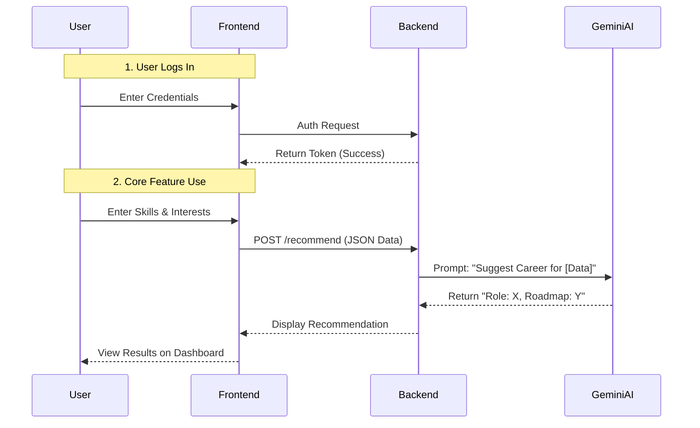
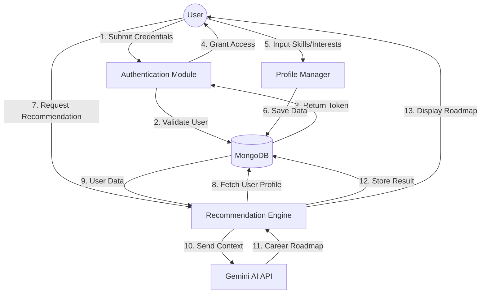

# [college / University Name]

### Department of [Department Name]

 
 

**Course:** [Course Name] & [Semester]

 
 

## PROJECT REPORT
**ON**

# PathFinder AI

*(Software Requirement Specification & Project Report)*

 
 

**Submitted To:**

**[Guide / Faculty Name]**  
*[Designation]*  

 

**Submitted By:**

**Name:** [Student Name]  
**Roll No:** [Roll Number]  
**Reg No:** [Registration Number]  

 
 

  
*(Optional: Insert College Logo)*

 
 

**[Place]**  
**[Date]**  

---

# Table of Contents
*   **Revision History** ................................................................. ii
*   **Chapter 1: Introduction**
    *   1.1 Purpose
    *   1.2 Aim
    *   1.3 Objectives
    *   1.4 Product Scope
    *   1.5 User Classes and Characteristics
    *   1.6 Operating Environment
    *   1.7 Assumptions and Dependencies
*   **Chapter 2: Literature Survey**
    *   2.1 Survey of Existing Systems
    *   2.2 Findings and Research Gap
*   **Chapter 3: System Architecture**
    *   3.1 User Interfaces
    *   3.2 Hardware Interfaces
    *   3.3 Software Interfaces
    *   3.4 Communications Interfaces
    *   3.5 System Features
*   **Chapter 4: System Flow / Architecture**
    *   4.1 System Flow (Architecture)
    *   4.2 Data Flow Diagram (DFD)
    *   4.3 API Data Flow Verification
*   **Chapter 5: Model Design**
    *   5.1 Phase I: Requirement Analysis
    *   5.2 Phase II: Backend Implementation (Current)
    *   5.3 Phase III: Frontend Integration (Future)
*   **Chapter 6: Conclusion**
*   **Chapter 7: Future Scope**
*   **Appendix A: List of Figures**
*   **Appendix B: List of Tables**
*   **Appendix C: List of Acronyms**

---

# Revision History

| Version | Date       | Description                                 | Author          |
| :------ | :--------- | :------------------------------------------ | :-------------- |
| 1.0     | 2024-12-19 | Initial Draft of SRS and Project Report     | [Student Name]  |
| 1.1     | 2024-12-19 | Updated with Core Recommendation Flow Logic | [Student Name]  |

---

# Chapter 1: Introduction

### 1.1 Purpose
PathFinder AI is designed as a specialized career guidance platform. Its primary purpose is to help users identify their optimal career paths by analyzing their specific inputs—skills, interests, and qualifications. Unlike generic job boards, this system actively processes user attributes to generate tailored career recommendations using Artificial Intelligence.

### 1.2 Aim
The aim of the project is to build a functional web application that bridges the gap between a student's current skill set and industry requirements. The system aims to provide a streamlined "Input-to-Insight" flow, where a user enters their profile data and immediately receives a generated career roadmap.

### 1.3 Objectives
-   **Core Recommendation Engine:** To develop a backend logic that accepts user skills and interests (e.g., "JavaScript", "Design") and maps them to suitable job roles (e.g., "Frontend Developer").
-   **User Profiling:** To implement a structured input mechanism for users to log their qualifications and technical domains.
-   **Security:** To ensure safe user access through encrypted Login/Logout modules.
-   **Interactive Dashboard:** To present the generated recommendations in a clear, user-friendly dashboard format.

### 1.4 Product Scope
The current implementation scope maps to the academic semester requirements: leading effectively from **Login** -> **Profile Input** -> **Recommendation Display**.
-   **Completed:** User Authentication (Login/Register), Profile Management (Enter Skills/Interests), and the Core AI Recommendation Generator.
-   **Future:** Resume PDF Parsing (Automated extraction), Community features, and Advanced Gamification are out of scope for this phase.

### 1.5 User Classes and Characteristics
-   **Students/Job Seekers:** Users with varying levels of technical expertise looking for career clarity.
-   **Admin:** Maintenance of system uptime and user database management.

### 1.6 Operating Environment
-   **Frontend:** Web Browser (Chrome/Edge) running React.js.
-   **Backend:** Node.js server environment.
-   **Database:** MongoDB Cloud (Atlas).

### 1.7 Assumptions and Dependencies
-   **Assumption:** Users will manually provide accurate details regarding their skills and interests if automated parsing is unavailable.
-   **Dependency:** Requires active internet connection for Google Gemini API calls.

---

# Chapter 2: Literature Survey

### 2.1 Survey of Existing Systems
Existing systems typically fall into two categories: manual career counseling (expensive, slow) or keyword-based job search engines (impersonal). Few platforms exist that allow a student to simply "enter skills" and receive a "generated roadmap" in real-time without extensive profile building.

### 2.2 Findings and Research Gap
Most student-level projects focus on "Resume Screening" (ATS). There is a gap for a "Career Recommender" that focuses on the *potential* of the candidate based on interests, not just their past history. PathFinder AI fills this gap by weighing "Interests" equally with "Skills".

---

# Chapter 3: System Architecture

### 3.1 User Interfaces
*(Currently Implemented Layouts)*
-   **Home Page:** Features a gamified concept with "Get Started" call-to-actions.
-   **Login/Signup:** Functional forms with validation for secure access.
-   **Dashboard:** The main view where users see their "Recommended Career Paths" card after entering their data.

*(Figure 3.1: Dashboard UI Placeholder)*

### 3.2 Hardware Interfaces
Standard Server-Client architecture. No specialized hardware required.

### 3.3 Software Interfaces
-   **MERN Stack:** MongoDB, Express.js, React, Node.js.
-   **AI Interface:** Gemini Pro via REST API.

### 3.4 Communications Interfaces
-   **API:** RESTful endpoints for `POST /api/auth` and `POST /api/recommend`.
-   **Format:** JSON payloads.

### 3.5 System Features
*(Status: Implemented vs Future)*
1.  **User Authentication (Implemented):** Full Register/Login/Logout cycle with JWT encryption.
2.  **Profile Input (Implemented):** Form-based entry for Skills, Interests, and Qualifications.
3.  **Recommendation Engine (Implemented):** Backend logic that processes the profile inputs and returns career suggestions.
4.  **Dashboard Display (Implemented):** Frontend logic to fetch and render the recommendation text.
5.  **Resume Parsing (Future):** Automated PDF extraction (currently experimental).

---

# Chapter 4: System Flow / Architecture

### 4.1 System Flow (Architecture)

The following diagram illustrates the active data flow in the current version of the project:

*(Figure 4.1: Sequence Diagram of Implemented Flow)*

### 4.2 Data Flow Diagram (DFD)

The Data Flow Diagram (Level 1) below visualizes the flow of information between the User, the Backend System, and the External AI Service.

*(Figure 4.2: Level 1 Data Flow Diagram)*

### 4.3 API Data Flow Verification
To ensure the integrity of the system and the reliability of the recommendation logic, the complete "Input-to-Insight" data flow was verified using Postman. This testing cycle corresponds to the user's journey: authenticating, building a profile, and receiving a career roadmap.

#### 4.3.1 User Authentication
The first step verifies secure access. The `/api/auth/login` endpoint is tested to ensure that valid credentials return a **JSON Web Token (JWT)**, which is required for all subsequent requests.
*(Figure 4.3a: Postman - User Login & Token Generation)*

#### 4.3.2 Profile Management (Skills & Interests)
Once authenticated, the user builds their profile. We verified the endpoints for adding technical skills and professional interests, which serve as the context for the AI.
-   **Add Skill:** `POST /api/skills`
    *(Figure 4.3b: Postman - Adding a Skill)*
    

-   **Add Interest:** `POST /api/interests`
    *(Figure 4.3c: Postman - Adding an Interest)*
    

#### 4.3.3 AI Recommendation Generation
Finally, the system aggregates the user's profile and sends a request to the AI engine. The backend processes the stored skills and interests to generate a tailored career path.
*(Figure 4.3d: Postman - Final AI Recommendation Response)*

---

# Chapter 5: Model Design

The project development is divided into three distinct phases.

### 5.1 Phase I – Requirement Analysis (Completed)
-   Defined the core problem: "Students need automated career advice."
-   Designed the schema for Users and Recommendations.
-   Selected MERN stack for scalability.

### 5.2 Phase II – Backend Implementation (Current Status: ~50% Completed)
-   **Authentication Module:** Fully functional Login/Logout and Signup APIs.
-   **Recommendation Logic:** The core business logic is complete. The system successfully accepts a list of skills (e.g., "React, Node") and interests (e.g., "Problem Solving") and returns a valid Career Path using AI.
-   **Database Integration:** MongoDB is successfully storing user profiles and generated recommendations.

### 5.3 Phase III – Frontend Integration (Future Work)
-   While the **Home Page**, **Login**, and **Dashboard** (Display) are working, the remaining modules (History View, Detailed Analytics, Gamification Badges) are scheduled for the next semester.
-   Full integration of the automated PDF parser into the frontend flow is also planned for Phase III to enhance the manual input system.

---

# Chapter 6: Conclusion

PathFinder AI has successfully demonstrated the feasibility of an AI-driven Career Recommender. The "Partial Implementation" goals have been met: a user can securely log in, provide their professional details, and receive an intelligent, AI-generated career recommendation. The backend logic is robust, and the essential frontend interfaces are operational. The foundation is set for expanding this into a comprehensive professional development platform in the upcoming academic session.

---

# Chapter 7: Future Scope

The following features are designed but reserved for the next phase of development:
1.  **Automated Resume Parser:** Replacing manual entry with one-click PDF upload.
2.  **Advanced Gamification:** Adding badges and leaderboards to the Home Page.
3.  **Community Features:** Peer-to-peer mentorship forums.
4.  **Mock Interviews:** AI-voice based interview practice.
5.  **Mobile App:** React Native adaptation of the web platform.
6.  **Skill Verification Quizzes:** Integration of interactive quizzes to validate claimed skills. This feature is currently represented in the dashboard sidebar navigation but awaiting backend implementation.
7.  **Goal Setting & Tracking:** A comprehensive module allowing users to set career milestones and track progress. This module is visually present in the dashboard sidebar to indicate future availability.

---

# Appendix A: List of Figures
-   Figure 1.1: High-Level Architecture (Refer to Ch 3)
-   Figure 3.1: Dashboard UI Wireframe
-   Figure 4.1: Sequence Diagram of Implemented Flow
-   Figure 4.1: Sequence Diagram of Implemented Flow
-   Figure 4.2: Level 1 Data Flow Diagram
-   Figure 4.3a: Postman - User Login & Token Generation
-   Figure 4.3b: Postman - Adding a Skill
-   Figure 4.3c: Postman - Adding an Interest
-   Figure 4.3d: Postman - Final AI Recommendation Response

# Appendix B: List of Tables
-   Table 1: Revision History

# Appendix C: List of Acronyms
-   **SRS:** Software Requirement Specification
-   **AI:** Artificial Intelligence
-   **LLM:** Large Language Model
-   **MERN:** MongoDB, Express, React, Node
-   **JWT:** JSON Web Token
-   **UI:** User Interface
