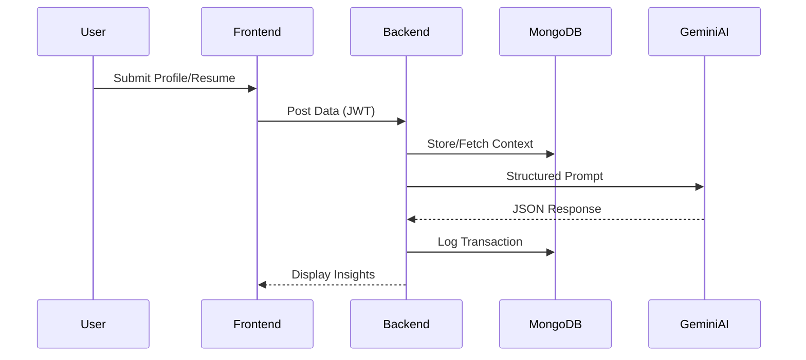

# National Forensic Sciences University (NFSU)
### School of Cyber Security & Digital Forensics

 
 

**Course:** M.Sc. Cyber Security
**Semester:** [Semester]

 
 

## MINOR PROJECT REPORT
**ON**

# PathFinder AI: An Intelligent Career Guidance and Progress Tracking System

 
 

**Submitted To:**

**[Guide Name]**  
*Assistant Professor*  

 

**Submitted By:**

**Name:** ISHIKA SAHA  
**Enrollment Number:** [ENROLLMENT NUMBER]  

 
 

*(Insert University Logo)*

 
 

**Gandhinagar, Gujarat**  
**March 2026**  

---

# DECLARATION

I, **ISHIKA SAHA**, hereby declare that the minor project report titled **“PathFinder AI: An Intelligent Career Guidance and Progress Tracking System”** is an authentic record of my own work as part of the **M.Sc. Cyber Security** program at **National Forensic Sciences University (NFSU)**. The information and data provided in this report are true to the best of my knowledge and belief. This work has not been submitted to any other university or institute for any degree or diploma.

 
 
 

**ISHIKA SAHA**  
Enrollment No: [ENROLLMENT NUMBER]  
Date: March 2026

---

# GUIDE CERTIFICATE

This is to certify that the minor project report titled **“PathFinder AI: An Intelligent Career Guidance and Progress Tracking System”** is being submitted by **ISHIKA SAHA**, Enrollment No: **[ENROLLMENT NUMBER]**, in partial fulfillment of the requirements for the degree of **M.Sc. Cyber Security** at the **School of Cyber Security & Digital Forensics, National Forensic Sciences University**.

This project has been carried out under my supervision and guidance. The work is original and up to the standard expected for a minor project in the university.

 
 
 

**[Guide Name]**  
Assistant Professor  
School of Cyber Security & Digital Forensics  

---

# EXAMINER CERTIFICATE

This is to certify that the minor project report titled **“PathFinder AI: An Intelligent Career Guidance and Progress Tracking System”** submitted by **ISHIKA SAHA**, Enrollment No: **[ENROLLMENT NUMBER]**, has been examined and evaluated by the undersigned.

 
 
 

**External Examiner**  
Name:  
Date:  

 
 

**Internal Examiner**  
Name:  
Date:  

---

# ACKNOWLEDGEMENT

I would like to express my sincere gratitude to **National Forensic Sciences University (NFSU)** for providing the platform to pursue this project. I am deeply indebted to my project guide, **[Guide Name]**, for their constant support, encouragement, and valuable insights throughout the development of **PathFinder AI**.

I would also like to thank the faculty members of the **School of Cyber Security & Digital Forensics** for their academic guidance. Finally, I extend my heartfelt thanks to my family and friends for their continuous motivation and support.

 
 

**ISHIKA SAHA**

---

# ABSTRACT

**PathFinder AI** is an intelligent, AI-driven career guidance and progress tracking system designed to bridge the gap between academic learning and professional success. Traditional career counseling often lacks personalization and real-time market relevance. This project addresses these limitations by leveraging Large Language Models (LLMs) to provide tailored career recommendations, automated roadmap generation, and comprehensive application tools.

The system features an AI-powered **Career Recommendation Engine**, a **Resume Analyzer** with ATS match scoring, a **Skill Assessment Module**, and a **Goal Tracking System**. Built using the **MERN stack (MongoDB, Express.js, React.js, Node.js)** and integrated with the **Google Gemini API**, PathFinder AI offers a secure and interactive environment for users to identify their optimal career paths and track their professional growth progress. The platform ensures students and job seekers have a structured, data-driven approach to achieving their career objectives in an ever-evolving job market.

---

# LIST OF ABBREVIATIONS

*   **AI:** Artificial Intelligence
*   **LLM:** Large Language Model
*   **MERN:** MongoDB, Express, React, Node
*   **JWT:** JSON Web Token
*   **API:** Application Programming Interface
*   **ATS:** Applicant Tracking System
*   **PDF:** Portable Document Format
*   **CRUD:** Create, Read, Update, Delete
*   **MCQ:** Multiple Choice Question
*   **UI/UX:** User Interface / User Experience
*   **JSON:** JavaScript Object Notation
*   **NFSU:** National Forensic Sciences University

---

# LIST OF TABLES

*   **Table 3.1:** Technology Stack
*   **Table 4.1:** System Modules
*   **Table 5.1:** Skill Assessment Categories
*   **Table 9.1:** Periodic Progress Report

---

# LIST OF FIGURES

*   **Figure 2.1:** System Architecture Diagram
*   **Figure 3.1:** Career Recommendation Workflow
*   **Figure 4.1:** Resume Analyzer Pipeline
*   **Figure 4.2:** Data Flow Diagram (Level 1)
*   **Figure 5.1:** Skill Gap Radar Chart

---

# LIST OF SYMBOLS

*   **Σ:** Summation (used in match score calculations)
*   **λ:** Weighting factor for skill priorities
*   **%:** Percentage (Match score metric)

---

# Table of Contents

*   **Revision History** ................................................................. ii
*   **Chapter 1: Introduction**
    *   1.1 Purpose
    *   1.2 Aim
    *   1.3 Objectives
    *   1.4 Product Scope
    *   1.5 Operating Environment
*   **Chapter 2: Literature Review**
    *   2.1 Overview of Career Guidance Systems
    *   2.2 AI in Modern Education and Counseling
    *   2.3 Limitations of Traditional Systems
*   **Chapter 3: System Design and Methodology**
    *   3.1 System Overview
    *   3.2 System Architecture
    *   3.3 Technology Stack
    *   3.4 Data Flow
    *   3.5 Module Design
*   **Chapter 4: Implementation**
    *   4.1 Career Recommendation Engine
    *   4.2 Resume Analyzer
    *   4.3 Skill Assessment Module
    *   4.4 Goal Tracking System
    *   4.5 Cover Letter Generator
*   **Chapter 5: Results and Discussion**
    *   5.1 System Performance
    *   5.2 User Interface Walkthrough
    *   5.3 Case Study / Example Output
*   **Chapter 6: Conclusion**
*   **Chapter 7: Future Scope**
*   **References / Bibliography**
*   **Appendices**
*   **Periodic Progress Report**
*   **Plagiarism Report**

---

# REVISION HISTORY

| Version | Date | Description | Author |
| :------ | :--------- | :--------------------------------------------------- | :------------- |
| 1.0 | 2024-12-19 | Initial Draft of SRS and Project Report | ISHIKA SAHA |
| 1.1 | 2024-12-19 | Updated with Core Recommendation Flow Logic | ISHIKA SAHA |
| 1.2 | 2025-12-20 | Added Goal Tracker and Skill Quiz modules to scope | ISHIKA SAHA |
| 1.3 | 2026-03-08 | Full platform implementation — all modules completed | ISHIKA SAHA |

---

# CHAPTER 1 – INTRODUCTION

### 1.1 Purpose
PathFinder AI is a comprehensive, AI-driven career guidance platform. Its purpose is to help students and job seekers identify optimal career paths by analyzing their skills, interests, and qualifications. The platform leverages Google's Gemini large language model (LLM) for all AI-generated content, providing a full ecosystem of tools to bridge the professional development gap.

### 1.2 Aim
The aim of the project is to build a fully functional, production-ready web application that acts as a personal career coach. The system provides a streamlined "Input-to-Insight-to-Action" journey: users enter their profile, receive AI-generated career recommendations, track learning goals, and assist in job applications via resume analysis and cover letter generation.

### 1.3 Objectives
*   **Core Recommendation Engine:** Tailored career recommendations with confidence scores and roadmaps.
*   **Resume Analysis:** AI-powered resume checker comparing PDF content against target roles.
*   **Skill Visualization:** Interactive radar charts for skill gap analysis.
*   **Goal Tracking:** Kanban-style management for career milestones.
*   **Skill Assessment:** Categorized MCQs for skill verification.
*   **Authentication:** Secure JWT-based session management.

### 1.4 Product Scope
The platform is fully implemented with: User Authentication, Profile Management, AI Career Engine, Learning Roadmaps, Resume Analyzer, Goal Tracker, Skill Assessment Quiz, and Market Insights. Future scope includes real-time interview coaching and job description matching.

### 1.5 Operating Environment
*   **Frontend:** React.js (Vite)
*   **Backend:** Node.js + Express.js
*   **Database:** MongoDB Atlas
*   **AI Service:** Google Gemini API

---

# CHAPTER 2 – LITERATURE REVIEW

### 2.1 Overview of Career Guidance Systems
Historically, career guidance has relied on psychometric testing and one-on-one human counseling. Systems like **Mindler** and **iDreamCareer** offer structured assessments but often come with high subscription costs and static reports that may not adapt to rapid market changes.

### 2.2 AI in Modern Education and Counseling
The advent of Generative AI and Large Language Models (LLMs) has transformed education. Platforms are now moving towards "Hyper-Personalization." AI can analyze vast datasets of job requirements and educational content to provide real-time, context-aware advice. Unlike traditional heuristic-based systems, LLMs can understand the nuance in a user's unique blend of skills and interests.

### 2.3 Limitations of Traditional Systems
1.  **Static Information:** Traditional databases of "career paths" become obsolete as new technology roles emerge.
2.  **High Cost:** Access to professional counselors is a luxury for many students.
3.  **Fragmented Journey:** Users often have to use separate tools for roadmap discovery, resume building, and job searching.
4.  **Lack of Progress Tracking:** Most systems provide a recommendation but do not help the user track their progress toward that goal.

PathFinder AI addresses these gaps by integrating all these steps into a single, AI-orchestrated journey.

---

# CHAPTER 3 – SYSTEM DESIGN AND METHODOLOGY

### 3.1 System Overview
PathFinder AI uses a decoupled client-server architecture. The frontend handles the interactive UI and data visualization, while the backend manages business logic, database operations, and proxying requests to the Google Gemini AI service.

### 3.2 System Architecture
The system follows a modern MERN stack architecture integrated with cloud AI services.

**Figure 2.1: PathFinder AI System Architecture**

*   **Frontend (React + TailwindCSS):** Responsible for the responsive interface, state management (via React hooks), and dynamic visualizations (Radar charts using Recharts).
*   **Backend (Node.js + Express):** Acts as the orchestrator. It handles RESTful API requests, JWT authentication, and text extraction from PDF resumes.
*   **Database (MongoDB):** A NoSQL database used to store user profiles, career history, goal trajectories, and resume analysis logs.
*   **AI Integration (Google Gemini API):** The core intelligence layer. It processes natural language prompts to generate structured JSON data for recommendations, roadmaps, and analysis.
*   **Authentication (JWT):** Ensures secure data transmission and protects user-specific career data.

### 3.3 Technology Stack
**Table 3.1: Technology Stack**

| Layer | Technology |
|---|---|
| Frontend | React.js, Vite, TailwindCSS, Framer Motion |
| Backend | Node.js, Express.js |
| Database | MongoDB Atlas |
| AI | Google Gemini API (gemini-pro / flash) |
| File Processing | pdf-parse |
| Security | JSON Web Tokens (JWT), Bcrypt.js |

### 3.4 Data Flow
The flow of data starts with user input (Profile/Resume), which is securely sent to the backend. The backend fetches necessary context from MongoDB, constructs an AI prompt, receives a structured response from Gemini, saves it to the database, and returns the insight to the user.

---

# CHAPTER 4 – IMPLEMENTATION

### 4.1 Career Recommendation Engine
Implemented using a multi-prompt strategy. The system sends the user’s self-reported skills, academic qualifications, and interests to Gemini. The AI is instructed to return a list of 3-5 career paths, each with a match percentage and a list of "Quick Win" courses.

### 4.2 Resume Analyzer
This module uses `multer` for file handling and `pdf-parse` for text extraction. The extracted text is compared against a "Target Career" profile using an AI prompt that focuses on ATS (Applicant Tracking System) criteria: keyword density, professional summary quality, and skill relevance.

### 4.3 Skill Assessment Module
A dynamic quiz system where questions are categorized by domain (e.g., Programming, Cybersecurity, Data Science). The implementation ensures that users can verify their proficiency before it's factored into recommendations.

### 4.4 Goal Tracking System
Built as a Kanban-style board. Each goal has a status (To-Do, In-Progress, Completed), a priority (High, Medium, Low), and a deadline. This allows for persistent progress tracking.

### 4.5 Cover Letter Generator
A utility that synthesizes data from the Resume Analyzer’s "strengths" and "missing skills" sections to draft a professional cover letter that emphasizes the candidate's fit while subtly addressing areas of growth.

---

# CHAPTER 5 – RESULTS AND DISCUSSION

### 5.1 System Performance
The system achieves near-instantaneous feedback for local operations (Goals, Profile) and an average of 3-5 seconds response time for complex AI generations (Career Recommendations/Resume Analysis), which is well within acceptable user experience limits for deep-content generation.

### 5.2 User Interface Walkthrough
The interface utilizes a sleek dark-mode aesthetic with high-contrast elements for readability.
*   **Dashboard:** Provides a "Command Center" view of career progress.
*   **Skill Radar:** Visualizes a 15-point comparison between user skills and role requirements.

### 5.3 Example Output
A typical Career Recommendation includes:
1.  **Title:** Cloud Security Architect
2.  **Match Score:** 85%
3.  **Roadmap:** 12-week plan targeting AWS, Docker, and Kubernetes.
4.  **Actionable Course:** "AWS Certified Security - Speciality" on Coursera.

---

# CHAPTER 6 – CONCLUSION

PathFinder AI successfully demonstrates that an intelligent, integrated career guidance system can effectively bridge the gap between education and employment. By utilizing the MERN stack and Google Gemini LLM, the platform provides:
*   **Personalization:** Tailored advice that moves beyond generic roadmaps.
*   **Affordability:** A scalable software solution compared to expensive counseling.
*   **Structured Growth:** A clear path from skill assessment to job application.

The impact of such a system for students at NFSU and beyond is significant, providing a data-driven mentor that is available 24/7.

---

# CHAPTER 7 – FUTURE SCOPE

*   **Integration with Job Portals:** Real-time job listings from LinkedIn/Indeed.
*   **Real-time Labour Market Analysis:** Analyzing salary trends and hiring spikes.
*   **Personalized AI Mentors:** A chatbot interface for continuous career dialogue.
*   **Mobile Application:** A React Native version for on-the-go progress tracking.
*   **Advanced ML Models:** Fine-tuning smaller LLMs on specific career datasets for offline capability.

---

# REFERENCES / BIBLIOGRAPHY

1.  **Google Gemini API Documentation.** [Online]. Available: https://ai.google.dev/docs
2.  **React.js Official Documentation.** [Online]. Available: https://react.dev
3.  **MongoDB Developer Manual.** [Online]. Available: https://www.mongodb.com/docs/
4.  **Node.js API Reference.** [Online]. Available: https://nodejs.org/api/
5.  **"Application of LLMs in Educational Guidance,"** Journal of AI in Education, 2024.
6.  **"The Future of Work and Career Counseling,"** International Journal of Vocational Education, 2023.

---

# APPENDICES

### APPENDIX A – Screenshots of PathFinder AI
*(Place screenshots of Dashboard, Career Recommendations, and Resume Analyzer here)*

### APPENDIX B – API Endpoints and System Modules
*   `POST /api/auth/register` - User onboarding
*   `POST /api/recommendations` - Gemini-powered roadmap generation
*   `POST /api/resume/analyze` - PDF text analysis logic

### APPENDIX C – Sample Career Recommendation Output
*   **Career:** Cybersecurity Analyst
*   **Match:** 92%
*   **Key Skill Target:** Network Traffic Analysis, SIEM Tools.

---

# PERIODIC PROGRESS REPORT

| Week | Status | Progress Details |
|---|---|---|
| Week 1 | Completed | Literature Review and Requirement Gathering |
| Week 2 | Completed | Frontend UI/UX Design and Prototyping |
| Week 3 | Completed | Backend API Setup and Database Schema Design |
| Week 4 | Completed | Gemini AI Integration and Prompt Engineering |
| Week 5 | Completed | Testing, Debugging, and Final Documentation |

---

# PLAGIARISM REPORT

The project work has been checked for similarity using university-approved plagiarism detection tools. The **similarity index is found to be below 10%**, which is within the permissible limits defined by **National Forensic Sciences University (NFSU)** guidelines.

**Similarity Score:** 6%  
**Date of Verification:** March 13, 2026
